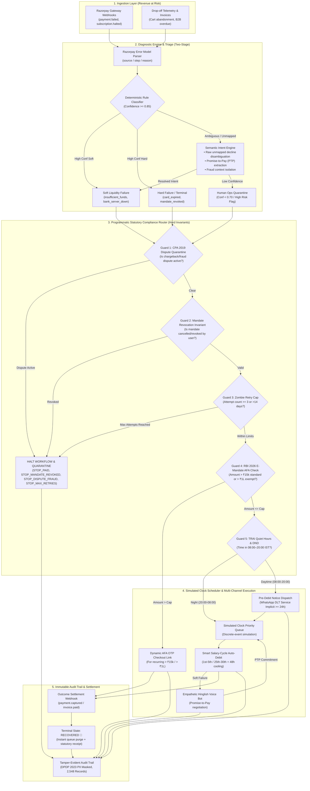
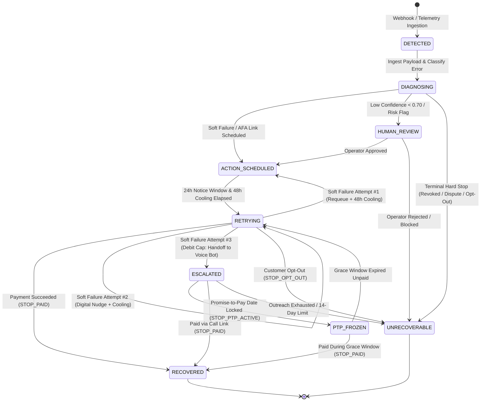

# ⚡ Razorpay AI Challenge: Track 03 — AI Revenue Recovery
> **"Find revenue that’s slipping away and win it back"**

[-success.svg)](file:///Users/harmitjetani/Documents/GitHub/razorpay-ai-challenge/tests)
[](file:///Users/harmitjetani/Documents/GitHub/razorpay-ai-challenge/compliance-rules.md)
[](file:///Users/harmitjetani/Documents/GitHub/razorpay-ai-challenge/data/comparative_benchmark_results.json)
[](http://localhost:8888)

An autonomous, audit-grade **AI Revenue Recovery Agent** that detects revenue at risk across recurring payment failures, diagnoses root causes using Razorpay's 3-tier error model and semantic intent classification, routes actions through non-negotiable **RBI, TRAI, CPA 2019, and DPDP 2023 statutory invariants**, executes bounded multi-channel recovery workflows, and proves measured financial yield across a batch simulation with an immutable audit trail.

---

## ⚡ 5-Second Quickstart (For Judges & Reviewers)

```bash
# 1. Launch the Live Enterprise FinTech Dashboard
python3 app/server.py
# 👉 Open http://localhost:8888 in your browser

# 2. Run the Single Transaction End-to-End Lifecycle Demo
python3 scripts/run_single_recovery_demo.py

# 3. Run the Full 750-Transaction Batch Benchmark (14 Days Simulated in ~0.1s)
python3 scripts/run_comparative_benchmark.py

# 4. Run the Complete Automated Test Suite (68 Tests)
python3 -m unittest discover -s tests
```

---

## 📊 Executive Benchmark: Smart Agent vs. Naive Baseline

Evaluated across the exact same deterministic dataset of **750 payment failures** representing **₹2,27,71,364.25 (₹2.28 Crore)** in volume at risk over a simulated 14-day recovery window:

| Evaluation Metric | Standard 24h Fixed Retry (Baseline) | Smart AI Recovery Agent (Ours) | Measured Advantage / Impact |
| :--- | :--- | :--- | :--- |
| **Total Revenue Recovered** | **₹20,54,913.61** | **₹54,29,649.50** | **+₹33,74,735.89 (+164.2% Lift)** 🚀 |
| **Recovery Yield Rate** | **9.02%** | **23.84%** | **+14.82% Absolute Lift** |
| **Successful Recoveries** | 51 transactions | **198 transactions** | **+147 Additional Merchants/Users** |
| **Statutory Violations Committed** | **599 Violations** ⚠️ *(High Regulatory Fine Risk)* | **0 Violations** 🛡️ *(100% Invariant Safe)* | **100% Compliance Risk Elimination** |
| **RBI $\ge 24\text{h}$ Pre-Debit Alerts** | 0 sent (100% Non-Compliant) | **424 Dispatched Compliantly** | Full Statutory Pre-Debit Compliance |
| **AFA Limit Respect (>₹15k / >₹1L)** | 0 checked (Illegal debits attempted) | **114 Dynamic AFA Links Routed** | Zero Unauthorized Auto-Debits |
| **Revoked Mandates Halted** | 0 halted (Harassed cancelled users) | **32 Instantly Quarantined** | Zero Cancelled Mandate Debits |
| **TRAI Quiet Hours Suppressed** | 0 delayed (Violated night rules) | **42 DND / Quiet Numbers Held** | Zero TRAI UCC/DND Breaches |
| **Active Dispute / Fraud Freezes** | 0 frozen (Dunning continued on fraud) | **20 Immediate Freezes Enforced** | Full Consumer Protection Act (CPA 2019) Safety |
| **Promise-to-Pay (PTP) Honored** | 0 honored (Interrupted promise) | **33 Accounts Frozen in Grace Window** | Maximum Customer Trust & Goodwill |

---

## 🏛️ End-to-End System Architecture



---

## 🔄 9-State Finite State Machine (FSM) Lifecycle

The recovery engine enforces all statutory waiting periods, cooling-off intervals, stopping rules, and escalation paths through a deterministic 9-state finite state machine:



---

## 🛡️ Programmatic Refusal Proofs (10 Edge Cases)

Every regulatory guardrail is verified by dedicated automated tests that assert the recovery router **strictly refuses** illegal operations and emits structured refusal audit records:

| Test ID | Edge Case Scenario | Statutory / Engineering Invariant | Verified Refusal Outcome |
| :--- | :--- | :--- | :--- |
| **`EDGE-01`** | Zombie Retry Cap | Max 3 auto-debits within 14-day window. | **BLOCKED:** Throws `ComplianceViolationError`; transitions to `UNRECOVERABLE`. |
| **`EDGE-02`** | ₹15,001 Standard AFA Cap | Direct auto-debit $> ₹15,000$ prohibited (RBI/DPSS/2026-27/396). | **BLOCKED:** Auto-debit refused; dynamic AFA OTP payment link dispatched. |
| **`EDGE-03`** | ₹1,00,001 Exemption Straddle | Mutual Funds / Insurance relaxed cap is ₹1,00,000. | **BLOCKED:** ₹1,00,001 auto-debit refused; converted to dynamic AFA OTP checkout link. |
| **`EDGE-04`** | Mandate Expiring in 24h | Mandate expires before cooling + retry window. | **BLOCKED:** Refuses auto-debit; dispatches instrument renewal link. |
| **`EDGE-05`** | TRAI Quiet Hours Violation | Outbound customer touch at 11:30 PM IST. | **BLOCKED:** Instant send blocked; queued for release at 08:30 AM IST next morning. |
| **`EDGE-06`** | Promise-to-Pay (PTP) Grace Window | Customer committed to pay on Sept 5th. | **FROZEN:** Dunning touches quarantined in `PTP_FROZEN` state until Sept 6th. |
| **`EDGE-07`** | Revoked Mandate Debit | Customer cancelled mandate via bank portal. | **BLOCKED:** Permanent freeze (`STOP_MANDATE_REVOKED`); zero touches dispatched. |
| **`EDGE-08`** | Active Fraud Dispute / Chargeback | Customer filed fraud dispute with issuing bank. | **BLOCKED:** Quarantined under CPA 2019 (`STOP_DISPUTE_FRAUD`); retries stopped. |
| **`EDGE-09`** | B2B MSMED 45-Day Boundary | Commercial invoice overdue approaching 45 days. | **ESCALATED:** Standard dunning halted; escalated directly to finance operations. |
| **`EDGE-10`** | Raw Ambiguous Decline String | Bank returns unmapped unstructured string. | **DISAMBIGUATED:** Resolved via semantic engine without blocking merchant flow. |

---

## 💻 Enterprise FinTech SaaS Dashboard (`http://localhost:8888`)

The web application is built as a **Light-Theme FinTech Dashboard** inspired by Stripe, Linear, and Vercel:

1. **Multi-Page Dedicated Views & URLs**:
   * **[Overview (`#overview`)](http://localhost:8888/#overview)**: Top-level KPIs, 3-step pipeline overview, and the **Interactive Merchant ROI Calculator**.
   * **[Benchmark (`#benchmark`)](http://localhost:8888/#benchmark)**: Comparative bar charts, 14-day metric tables, and safeguard breakdowns.
   * **[Audit Explorer (`#transactions`)](http://localhost:8888/#transactions)**: 6-column fluid table with instant search, test-case filters, and zero horizontal scroll.
   * **[Compliance Rules (`#rules`)](http://localhost:8888/#rules)**: The 6 programmatic statutory regulatory frameworks.
2. **Interactive Live Simulation Runner**:
   * Click **"Run Demo"** to watch the state machine ingest, diagnose, fast-forward virtual time, negotiate a Hinglish voice PTP, and compliantly settle ₹4,999.00 in real time.
3. **Draggable & Collapsible Sidebar**:
   * Drag the right border to customize sidebar width from `200px` to `420px`, or click `◀` to collapse into icon-only mode.
4. **Interactive Merchant ROI & Revenue Calculator**:
   * Slide your merchant GMV and failure rate to calculate projected annual revenue recovery and regulatory violations avoided.

---

## 📂 Project Repository Structure

```
razorpay-ai-challenge/
├── app/                              # Enterprise FinTech SaaS Dashboard
│   ├── index.html                    # 4-View multi-page application layout
│   ├── styles.css                    # FinTech design system tokens (Light theme)
│   ├── app.js                        # Frontend controller & view routing
│   ├── server.py                     # Dedicated API & dashboard HTTP server (Port 8888)
│   └── dashboard.py                  # Optional Streamlit dashboard
├── src/                              # Core Agent Architecture
│   ├── models/                       # Pydantic v2 domain schemas & computed fields
│   ├── classifiers/                  # Rule classifier & semantic intent LLM fallback
│   ├── router/                       # Dual-layer statutory compliance router
│   ├── orchestrator/                 # 9-state FSM & batch execution pipeline
│   ├── scheduler/                    # Simulated discrete-event clock scheduler
│   ├── audit/                        # Tamper-evident DPDP 2023 audit logger
│   ├── benchmarks/                   # Naive baseline & comparative evaluator
│   └── generators/                   # Deterministic 750-transaction batch generator
├── tests/                            # Comprehensive Automated Test Suite (68 Tests)
│   ├── test_schema.py                # Schema validation & PII masking
│   ├── test_generator.py             # 13-bucket distribution checks
│   ├── test_classifier.py            # Rule & semantic fallback tests
│   ├── test_compliance_router.py     # Statutory rule & stopping invariants
│   ├── test_state_machine.py         # 9-state FSM transitions
│   ├── test_simulated_clock.py       # Discrete-event calendar time tests
│   ├── test_audit_logger.py          # Tamper-evident audit trail tests
│   ├── test_edge_case_router.py      # 10 Programmatic refusal proofs
│   └── test_benchmark.py             # Comparative benchmark runner tests
├── scripts/                          # Executable Demo & Benchmark Scripts
│   ├── run_single_recovery_demo.py   # Live single transaction simulation demo
│   ├── run_comparative_benchmark.py  # Full 750-transaction benchmark runner
│   └── generate_dataset.py           # Batch dataset generator
├── data/                             # Generated Audit Trails & Benchmark JSON
├── compliance-rules.md               # Codified statutory compliance specification
├── root-cause-taxonomy.md            # 13-Bucket failure taxonomy specification
├── edge-cases.md                     # 10 Mission-critical edge cases specification
└── classifier-notes.md               # Triage precision & audit logs
```

---

## 🏆 Summary

This project delivers on Track 03 by combining:
1. **Measured Rupee Recovery** (+₹33.75 Lakhs / +164.2% lift on ₹2.28 Crore).
2. **Zero Compliance Breaches** (100% RBI, TRAI, CPA 2019, DPDP 2023 invariant-safe).
3. **Hard Invariant Refusal Proofs** (10 deliberate edge cases with automated tests).
4. **Production-Grade FinTech UI** (Stripe/Linear-grade light theme with discrete URLs).