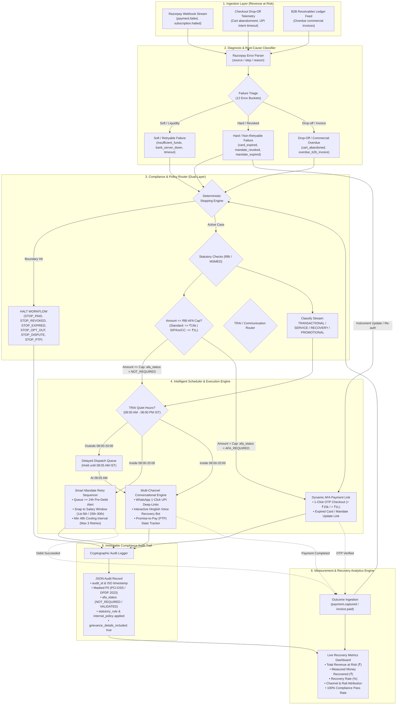

# Razorpay AI Challenge: Track 03 — AI Revenue Recovery
> **"Find revenue that’s slipping away and win it back"**

An autonomous, audit-grade AI Revenue Recovery Agent that detects revenue at risk across recurring payment failures, checkout abandonments, and overdue B2B receivables, diagnoses root causes using Razorpay's 3-tier error model, routes actions through statutory RBI/TRAI compliance policies, executes bounded interventions, and proves measured money recovered with an immutable audit trail.

---

## 🏛️ End-to-End System Architecture

---

## 🔄 Architectural Stage Breakdown

### 1. Ingestion Layer (`Revenue at Risk`)
* Ingests real-time payment degradation, webhook failures, and telemetry across 4 core streams:
  * **Failed Subscriptions:** `payment.failed`, `subscription.halted` on cards and UPI AutoPay.
  * **Network & Gateway Degrades:** Timeout webhooks, CBS banking 503 outages.
  * **Checkout Abandonments:** Cart drop-off telemetry and UPI intent session expirations.
  * **B2B Receivables Ledger:** Overdue commercial tax invoices.

### 2. Diagnosis & Root-Cause Classifier
* Analyzes Razorpay's native 3-tier error hierarchy: **`source`** (`customer`, `gateway`, `bank`, `business`, `network`), **`step`**, and **`reason`**.
* Deterministically maps events into **12 concrete error buckets** documented in [root-cause-taxonomy.md](file:///Users/harmitjetani/Documents/GitHub/razorpay-ai-challenge/root-cause-taxonomy.md).
* Classifies failures into:
  * **Soft / Retryable:** Temporary liquidity shortfalls (`insufficient_funds`), bank server outages (`bank_server_down`), network timeouts.
  * **Hard / Non-Retryable:** Expired instruments (`card_expired`), revoked mandates (`mandate_cancelled_by_user`), expired validity (`mandate_validity_expired`).
  * **Drop-offs & Receivables:** Abandoned checkouts and overdue B2B invoices.

### 3. Compliance & Policy Router (Dual-Layer Governance)
* Enforces strict regulatory boundaries documented in [compliance-rules.md](file:///Users/harmitjetani/Documents/GitHub/razorpay-ai-challenge/compliance-rules.md):
  * **Deterministic Stopping Rules:** Instantly halts workflows on `STOP_PAID`, `STOP_MANDATE_REVOKED`, `STOP_MANDATE_EXPIRED`, `STOP_OPT_OUT`, `STOP_DISPUTE_FRAUD`, `STOP_PTP_ACTIVE`, and `STOP_MAX_RETRIES`.
  * **RBI 2026 E-Mandate AFA Verification:** Checks if amount $\le ₹15,000$ (Standard) or $\le ₹1,00,000$ (Exempt categories: Mutual Funds, Insurance, Credit Card bills). Prohibits direct auto-debit if cap is exceeded.
  * **Communication Classification (TRAI TCCCPR):** Tags messages as `TRANSACTIONAL`, `SERVICE`, `RECOVERY`, or `PROMOTIONAL` and applies DND filters.
  * **MSMED Act 2006 (Sections 15 & 16):** Scopes commercial invoices from registered Micro & Small Enterprise (MSE) suppliers to the 45-day statutory ceiling.

### 4. Intelligent Scheduler & Execution Engine
* **TRAI Quiet Hours Filter:** Restricts automated interactions to **08:00 AM – 08:00 PM IST**. Late-night failures are safely held in the **Delayed Dispatch Queue** for 08:05 AM release.
* **Smart Mandate Retry Sequencer:**
  * Dispatches mandatory **$\ge 24$-hour Pre-Debit Notifications** with opt-out mechanisms.
  * Snaps retries to predicted salary/liquidity cycles (1st–5th / 25th–30th).
  * Enforces **$\ge 48$-hour cooling intervals** and a **hard cap of 3 retries**.
* **Dynamic AFA Payment Link Generator:** Dispatches 1-click OTP checkout links for charges $> ₹15\text{k} / ₹1\text{L}$ and mandate instrument update links.
* **Multi-Channel Conversational Engine:**
  * **WhatsApp 1-Click UPI Deep-Links:** Instant app-switch payment links for expired UPI collect requests.
  * **Hinglish AI Voice Recovery Agent:** Empathetic, respectful voice recovery with Promise-to-Pay (PTP) negotiation.
  * **Promise-to-Pay (PTP) Tracker:** Automatically freezes retries until `PTP_PROMISE_DATE + 24 hours`.

### 5. Immutable Compliance Audit Trail
* Generates structured, tamper-evident audit logs adhering to the compliance schema:
  * End-to-end PII masking (PCI-DSS tokenization & DPDP 2023 compliance).
  * Auditable `afa_status` (`NOT_REQUIRED`, `EXEMPT_CATEGORY_SIP_INS_CC`, `AFA_REQUIRED_LINK_SENT`, `VALIDATED`).
  * Explicit logging of `statutory_rule_applied` and `internal_policy_applied`.
  * Verification that post-debit receipts include statutory grievance redressal details.

### 6. Measurement & Recovery Analytics Engine
* Aggregates real-time business and compliance KPIs:
  * **Total Revenue at Risk ($\Sigma \text{Risk}$):** Ingested rupee volume of payment failures and drop-offs.
  * **Measured Money Recovered ($\Sigma \text{Recovered}$):** Confirmed rupee value recovered via retries, links, voice bots, and PTP fulfillment.
  * **Net Recovery Rate (%):** $\frac{\Sigma \text{Recovered}}{\Sigma \text{Risk}} \times 100$.
  * **Compliance Health:** Zero regulatory violations across AFA caps, pre-debit notices, calling hours, and stopping rules.

---

## 📂 Project Structure & Reference Documentation

| File | Purpose & Contents |
| :--- | :--- |
| **[compliance-rules.md](file:///Users/harmitjetani/Documents/GitHub/razorpay-ai-challenge/compliance-rules.md)** | Comprehensive dual-layer regulatory specification (RBI 2026 E-Mandate Framework, ₹15k/₹1L AFA caps, 24h pre-debit alerts, TRAI communication taxonomy, MSMED Act 45-day rule, DPDP Act 2023, 7 stopping rules, and audit schema). |
| **[root-cause-taxonomy.md](file:///Users/harmitjetani/Documents/GitHub/razorpay-ai-challenge/root-cause-taxonomy.md)** | Razorpay 3-tier error model taxonomy (`source` / `step` / `reason`), 12 concrete error buckets, retryability rules, 10 critical production edge cases (Zombie payments, salary cycle traps, race conditions, partial payments), and Python classifier code. |
| **[README.md](file:///Users/harmitjetani/Documents/GitHub/razorpay-ai-challenge/README.md)** | System architecture diagram (Mermaid.js), pipeline walkthrough, stage breakdown, and verification metrics. |

---

## 🎯 The Bar
> **Don’t just identify the problem. Show measured money recovered across a batch, with compliant escalation, stopping rules, and an audit trail.**