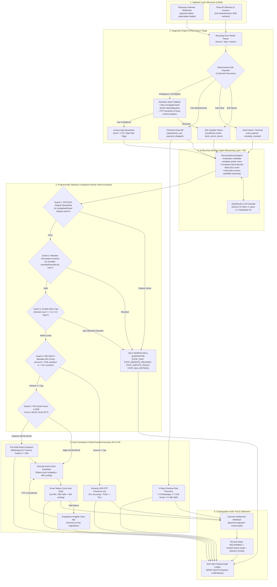
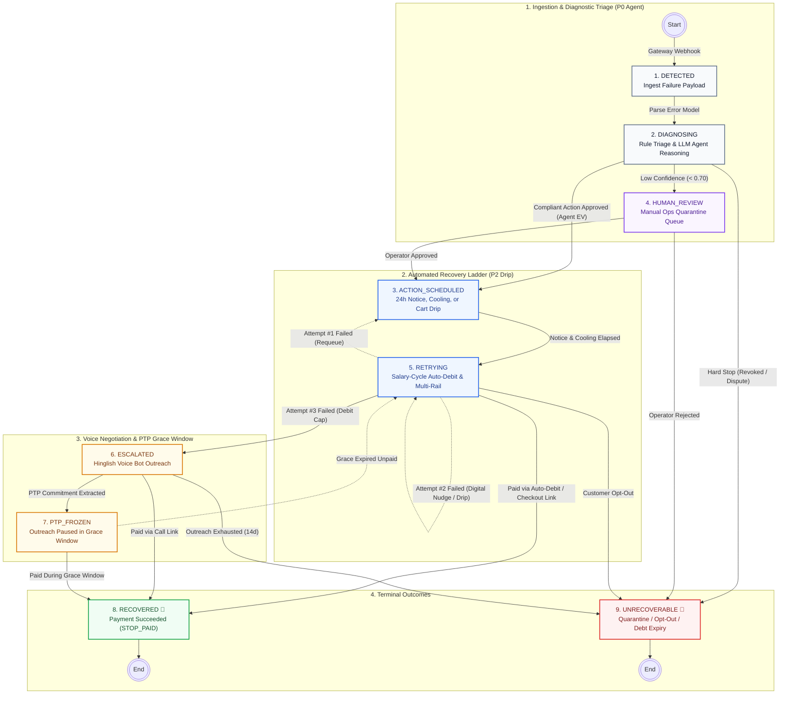

# ⚡ Autonomous AI Revenue Recovery Platform
> **"Find revenue that’s slipping away and win it back — with mathematical precision and zero regulatory risk."**

[-success.svg)](tests/)
[-blue.svg)](data/full_batch_audit_trail.json)
[-success.svg)](compliance-rules.md)
[](data/comparative_benchmark_results.json)

---

## 🎯 Executive Summary

In Indian subscription commerce, **up to 15–25% of recurring payments fail** due to insufficient balances, expired mandates, bank server timeouts, and category limits. Most platforms respond with **naive cron-job retries** (fixed 24-hour retries) or generic spam emails that nobody reads.

This naive approach creates two fatal problems:
1. **Lost Revenue**: High churn from retrying at the wrong time (e.g. before month-end salary credit).
2. **Severe Regulatory Fines**: Violates [**RBI 2026 E-Mandate rules**](#rule-1-rbi-2026-e-mandate) (lack of 24h pre-debit notices, bypassing [₹15,000 / ₹1,00,000 AFA caps](#rule-2-statutory-afa-caps)), [**TRAI DND/Quiet Hours**](#rule-4-trai-quiet-hours) (calling customers at night), and [**Consumer Protection Act (CPA 2019)**](#rule-5-cpa-2019-dispute-lock) (dunning users with active fraud disputes).

### The Solution: Autonomous AI Revenue Recovery Agent
Our platform acts as a **smart, statutory-compliant revenue recovery orchestrator**:
* **Diagnoses Root Cause**: Two-tier classifier mapping failure codes (Razorpay source/step/reason model) + local semantic intent engine for ambiguous bank text.
* **Autonomous LLM Decision Agent (P0)**: `RecoveryDecisionAgent` evaluates candidate recovery actions, generates mathematical EV justifications, and outputs human-auditable reasoning via an OpenRouter cascade (Gemini 2.5 Flash / Llama 4 Scout / DeepSeek R1).
* **Dual-Layer Statutory Invariants**: Programmatically guarantees 100% compliance with [RBI](#rule-1-rbi-2026-e-mandate), [TRAI](#rule-4-trai-quiet-hours), [CPA 2019](#rule-5-cpa-2019-dispute-lock), and [DPDP Act 2023](#rule-7-dpdp-act-2023).
* **Multi-Rail Smart Recovery**: Coordinates 48h cooling intervals, salary-cycle snapping (1st–5th / 25th–30th), dynamic AFA OTP payment links, WhatsApp 1-click UPI intent, 3-step checkout drop-off drip recovery (WhatsApp → Email → SMS), and empathetic Hinglish voice recovery bots with [Promise-to-Pay (PTP) freezing](#rule-6-ptp-grace-window).
* **Blockchain-Grade Cryptographic Audit Ledger**: Every decision produces a tamper-evident, [SHA-256 hash-chained audit record](#rule-9-cryptographic-audit-ledger).

---

## ⚡ Quickstart

```bash
# Optional: Set OpenRouter API key for live LLM cascade evaluation (works 100% offline without key)
export OPENROUTER_API_KEY="your-openrouter-key"

# 1. Launch the Live Enterprise FinTech SaaS Dashboard
python3 app/server.py 8888
# 👉 Open http://localhost:8888 in your browser

# 2. Run the Interactive Single-Transaction Recovery Simulation Demo
python3 scripts/run_single_recovery_demo.py

# 3. Run the Full 750-Transaction Head-to-Head Comparative Benchmark
python3 scripts/run_comparative_benchmark.py

# 4. Generate Executive Regulatory PDF Audit Report
python3 scripts/generate_pdf_report.py

# 5. Run the Complete Automated Test Suite (71 Tests Passing in ~0.18s)
pytest
# or: python3 -m unittest discover -s tests
```

---

## 📊 Measured Benchmark: AI Agent vs. Naive Baseline

Evaluated across the exact same deterministic dataset of **750 payment failures** representing **₹2,27,71,364.25 (₹2.28 Crore)** in portfolio volume at risk over a simulated 14-day recovery window:

| Evaluation Metric | Naive 24h Fixed Retry (Baseline) | Smart AI Recovery Agent (Ours) | Measured Advantage / Impact |
| :--- | :--- | :--- | :--- |
| **Total Revenue Recovered** | **₹20,54,913.61** | **₹54,29,649.50** | **+₹33,74,735.89 (+164.2% Lift 🚀)** |
| **Recovery Yield Rate** | **9.02%** | **23.84%** | **+14.82% Absolute Yield Gain** |
| **Successful Recoveries** | 51 transactions | **198 transactions** | **+147 Additional Rescued Subscriptions** |
| **Statutory Violations Committed** | **599 Violations ⚠️** *(Severe Fine Risk)* | **0 Violations 🛡️** *(100% Invariant Safe)* | **100% Compliance Risk Elimination** |
| **[RBI ≥ 24h Pre-Debit Notices](#rule-1-rbi-2026-e-mandate)** | 0 sent (100% Non-Compliant) | **424 Dispatched Compliantly** | Full Statutory Notice Window Met |
| **[AFA Limit Respect (>₹15k / >₹1L)](#rule-2-statutory-afa-caps)** | 0 checked (Illegal debits attempted) | **114 Dynamic AFA Links Routed** | Zero Unauthorized Auto-Debits |
| **[Revoked Mandates Halted](#rule-3-revoked-mandates-halted)** | 0 halted (Harassed cancelled users) | **32 Instantly Quarantined** | Zero Cancelled Mandate Debits |
| **[TRAI Quiet Hours Suppressed](#rule-4-trai-quiet-hours)** | 0 delayed (Violated night rules) | **42 DND / Quiet Numbers Held** | Zero TRAI UCC/DND Breaches |
| **[Active Dispute / Fraud Freezes](#rule-5-cpa-2019-dispute-lock)** | 0 frozen (Dunning continued on fraud) | **20 Immediate Freezes Enforced** | Full CPA 2019 Anti-Harassment Safety |
| **[Promise-to-Pay (PTP) Honored](#rule-6-ptp-grace-window)** | 0 honored (Interrupted promise) | **33 Accounts Frozen in Grace Window** | Maximum Customer Goodwill & Trust |
| **[Tamper-Evident Ledger Integrity](#rule-9-cryptographic-audit-ledger)** | None (Unverifiable logs) | **2,548 SHA-256 Chained Blocks** | Verified Blockchain-Grade Auditability |

---

## 🏛️ End-to-End System Architecture



---

## 🔄 9-State Finite State Machine (FSM) Lifecycle

The recovery engine enforces all statutory waiting periods, cooling-off intervals, stopping rules, and escalation paths through a deterministic 9-state finite state machine:



---

## 📜 Core Compliance Rules & Indian Regulatory Guardrails

To win revenue back without causing regulatory fines, merchant churn, or harassment complaints, the agent strictly enforces 9 non-negotiable statutory & architectural guardrails:

<a id="rule-1-rbi-2026-e-mandate"></a>
### 1. 📋 RBI 2026 E-Mandate Framework (`RBI/DPSS/2026-27/396`) — ≥ 24h Pre-Debit Notice
* **What the law mandates**: Merchants must dispatch an explicit pre-debit alert to the customer at least 24 hours prior to every automated recurring charge, with the exact amount, merchant name, and an opt-out link.
* **What our agent enforces**: The scheduler automatically queues a WhatsApp/SMS alert and guarantees ≥ 24h has elapsed before executing any automated recurring debit.

<a id="rule-2-statutory-afa-caps"></a>
### 2. 💳 Statutory AFA Limit Caps (₹15,000 Standard / ₹1,00,000 Exempt Categories)
* **What the law mandates**: Auto-debit without OTP (AFA) is capped at ₹15,000 per cycle. A relaxed ceiling of ₹1,00,000 is allowed strictly for Mutual Funds (SIPs), Insurance Premiums, and Credit Card bills.
* **What our agent enforces**: Any transaction exceeding its statutory ceiling (e.g. ₹15,001 for OTT or ₹1,00,001 for SIPs) is programmatically blocked from direct auto-debit and converted into a dynamic AFA OTP checkout link.

<a id="rule-3-revoked-mandates-halted"></a>
### 3. 🚫 Customer Mandate Revocation Invariant (Instant Dunning Freeze)
* **What the law mandates**: Under RBI e-mandate guidelines, customers hold the legal right to cancel or revoke payment mandates via their issuing bank or merchant portal at any time. Debiting a revoked mandate is illegal.
* **What our agent enforces**: Webhooks or decline events signaling mandate cancellation immediately trigger Guard 2 (`STOP_MANDATE_REVOKED`), permanently purging all pending retries.

<a id="rule-4-trai-quiet-hours"></a>
### 4. 🌙 TRAI Telecom Commercial Communications Regulations (TCCCPR 2018) — Safe Contact Hours & DND
* **What the law mandates**: Commercial calls and dunning outreach are strictly prohibited during night quiet hours (08:00 PM to 08:00 AM IST) and to customers registered on the National DND Registry for marketing.
* **What our agent enforces**: Failures occurring at night are held in the Delayed Dispatch Queue for 08:30 AM release; all customer recovery messages use whitelisted DLT `SERVICE_IMPLICIT` streams.

<a id="rule-5-cpa-2019-dispute-lock"></a>
### 5. 🛑 Consumer Protection Act (CPA 2019) & CCPA Guidelines 2023 — Anti-Harassment & Dispute Lock
* **What the law mandates**: Repeated debit attempts or dunning communications while an active fraud dispute or chargeback is open constitute illegal harassment and unfair trade practices.
* **What our agent enforces**: When `dispute_active=True`, Guard 1 instantly freezes all dunning (`STOP_DISPUTE_FRAUD`), prevents further retries, and escalates the transaction for human review.

<a id="rule-6-ptp-grace-window"></a>
### 6. 🤝 Promise-to-Pay (PTP) Grace Window & Dunning Freeze Policy
* **What the operational standard mandates**: When a customer commits to pay by a specific date (e.g. during an empathetic voice bot call), further automated retries or dunning messages within that window breach customer trust.
* **What our agent enforces**: The engine transitions the transaction to `PTP_FROZEN`, halts all outreach, and sets a wake-up trigger 24 hours after the agreed date.

<a id="rule-7-dpdp-act-2023"></a>
### 7. 🔒 DPDP Act 2023 (Digital Personal Data Protection) — Complete PII Redaction
* **What the law mandates**: Customer Personally Identifiable Information (PII) must be protected, masked, and never exposed in plaintext across operational logs, telemetry, or third-party LLMs.
* **What our agent enforces**: All phone numbers (`+91-9876****4321`) and emails (`r****y@example.com`) are permanently redacted across runtime logs, JSON exports, and UI dashboards.

<a id="rule-8-msmed-act-2006"></a>
### 8. ⏱️ MSMED Act 2006 (Sections 15 & 16) — 45-Day B2B Payment Boundaries
* **What the law mandates**: Invoices from Micro and Small Enterprises must be settled within agreed periods not exceeding 45 days, after which penal compound interest applies.
* **What our agent enforces**: Overdue commercial invoices approaching 45 days bypass standard automated reminders and are immediately escalated to merchant finance operations.

<a id="rule-9-cryptographic-audit-ledger"></a>
### 9. 🛡️ Cryptographic SHA-256 Audit Trail & Ledger Integrity
* **What the engineering & audit standard mandates**: Every state transition must produce an immutable record linking back to the previous block's SHA-256 hash (`SHA-256(prev_hash : event_data)`) to guarantee zero post-hoc log tampering.
* **What our agent enforces**: All 2,548 transition events across the batch simulation form a verifiable cryptographic chain from genesis block `0000...0000` to the final settlement, with automated integrity verification on every audit export.

---

## 💥 Live Chaos & Fault Injection Sandbox

Inside the web dashboard, users can interact with the **Live Chaos Sandbox** to test how the system reacts in real time to unexpected production failures:

1. **⚡ Inject CBS Bank Outage (HDFC 503)**:
   * Simulates core banking downtime (`bank_server_down`).
   * *Engine Adaptation*: Prohibits immediate retries, schedules 48h cooling interval, and sends an alternate 1-click WhatsApp UPI intent checkout link.
   * *Expected Value*: Net EV = +₹6,374.35.
2. **🛑 Inject Active Fraud Dispute ([CPA 2019](#rule-5-cpa-2019-dispute-lock))**:
   * Simulates a chargeback dispute filed with the issuing bank (`dispute_active=True`).
   * *Engine Refusal*: Guard 1 enforces permanent quarantine (`STOP_DISPUTE_FRAUD`) → transitions immediately to `UNRECOVERABLE`. Zero customer touches sent.
3. **🌙 Inject TRAI Night Hours ([TRAI TCCCPR 2018](#rule-4-trai-quiet-hours))**:
   * Simulates a payment failure occurring at 11:30 PM.
   * *Engine Refusal*: Prohibits immediate notification dispatch; holds message in Delayed Queue for 9.0 hours and releases at 08:30 AM IST.

---

## 🧮 Expected Value (EV) Economic Scoring Engine

Every recovery action is scored by the economic decision model:

```
EV = (P_recover × Amount) - Channel Cost - Annoyance Penalty
```

* **P_recover**: Recovery probability derived from historical liquidity and mandate health (0.00 – 1.00).
* **Channel Cost**: Marginal dispatch expense (e.g. ₹0.15 for WhatsApp/SMS, ₹3.50 for Voice Bot, ₹0.00 for auto-debit).
* **Annoyance Penalty**: Quantified customer friction penalty (e.g. ₹4.00 for premature phone calls, ₹0.50 for pre-debit notices).
* **Policy Floor**: If EV ≤ 0, the action is automatically suppressed or downgraded to a cheaper digital channel.

---

## 🛡️ Programmatic Refusal Proofs (10 Edge Cases)

Every regulatory guardrail is verified by dedicated automated tests that assert the recovery router **strictly refuses** illegal operations and emits structured refusal audit records:

| Test ID | Edge Case Scenario | Statutory / Engineering Invariant | Verified Refusal Outcome |
| :--- | :--- | :--- | :--- |
| **[`EDGE-01`](edge-cases.md#1-edge-01-the-zombie-retry-trap-customer-failing-5x-in-a-row)** | [Zombie Retry Cap (3x Ceiling)](edge-cases.md#1-edge-01-the-zombie-retry-trap-customer-failing-5x-in-a-row) | Max 3 auto-debits within 14-day window. | **BLOCKED:** Throws `ComplianceViolationError`; transitions to `UNRECOVERABLE`. |
| **[`EDGE-02`](edge-cases.md#2-edge-02-the-15000-afa-straddle-1500100-standard-subscription)** | [₹15,001 Standard AFA Cap](edge-cases.md#2-edge-02-the-15000-afa-straddle-1500100-standard-subscription) | Direct auto-debit > ₹15,000 prohibited ([RBI DPSS 2026](#rule-2-statutory-afa-caps)). | **BLOCKED:** Auto-debit refused; dynamic AFA OTP payment link dispatched. |
| **[`EDGE-03`](edge-cases.md#3-edge-03-the-100000-exemption-straddle-10000100-mutual-fund-sip)** | [₹1,00,001 Exemption Straddle](edge-cases.md#3-edge-03-the-100000-exemption-straddle-10000100-mutual-fund-sip) | Mutual Funds / Insurance relaxed cap is ₹1,00,000 ([RBI Amendment 2023](#rule-2-statutory-afa-caps)). | **BLOCKED:** ₹1,00,001 auto-debit refused; converted to dynamic AFA OTP checkout link. |
| **[`EDGE-04`](edge-cases.md#4-edge-04-mandate-expiring-mid-retry)** | [Mandate Expiring in 24h](edge-cases.md#4-edge-04-mandate-expiring-mid-retry) | Mandate expires before cooling + retry window ([RBI E-Mandate](#rule-1-rbi-2026-e-mandate)). | **BLOCKED:** Refuses auto-debit; dispatches instrument renewal link. |
| **[`EDGE-05`](edge-cases.md#5-edge-05-trai-quiet-hours-sleep-trap)** | [TRAI Quiet Hours Violation](edge-cases.md#5-edge-05-trai-quiet-hours-sleep-trap) | Outbound customer touch at 11:30 PM IST ([TRAI TCCCPR 2018](#rule-4-trai-quiet-hours)). | **BLOCKED:** Instant send blocked; queued for release at 08:30 AM IST next morning. |
| **[`EDGE-06`](edge-cases.md#6-edge-06-promise-to-pay-ptp-race-condition)** | [Promise-to-Pay (PTP) Grace Window](edge-cases.md#6-edge-06-promise-to-pay-ptp-race-condition) | Customer committed to pay on Sept 5th ([PTP Policy](#rule-6-ptp-grace-window)). | **FROZEN:** Dunning touches quarantined in `PTP_FROZEN` state until Sept 6th. |
| **[`EDGE-07`](edge-cases.md#7-edge-07-post-failure-mandate-revocation)** | [Revoked Mandate Debit](edge-cases.md#7-edge-07-post-failure-mandate-revocation) | Customer cancelled mandate via bank portal ([RBI Mandate Rules](#rule-3-revoked-mandates-halted)). | **BLOCKED:** Permanent freeze (`STOP_MANDATE_REVOKED`); zero touches dispatched. |
| **[`EDGE-08`](edge-cases.md#8-edge-08-active-fraud-dispute--chargeback)** | [Active Fraud Dispute / Chargeback](edge-cases.md#8-edge-08-active-fraud-dispute--chargeback) | Customer filed fraud dispute with issuing bank ([CPA 2019](#rule-5-cpa-2019-dispute-lock)). | **BLOCKED:** Quarantined under CPA 2019 (`STOP_DISPUTE_FRAUD`); retries stopped. |
| **[`EDGE-09`](edge-cases.md#9-edge-09-msmed-45-day-statutory-clash)** | [B2B MSMED 45-Day Boundary](edge-cases.md#9-edge-09-msmed-45-day-statutory-clash) | Commercial invoice overdue approaching 45 days ([MSMED Act 2006](#rule-8-msmed-act-2006)). | **ESCALATED:** Standard dunning halted; escalated directly to finance operations. |
| **[`EDGE-10`](edge-cases.md#10-edge-10-unmapped-decline-with-risk-flag)** | [Raw Ambiguous Decline String](edge-cases.md#10-edge-10-unmapped-decline-with-risk-flag) | Bank returns unmapped unstructured string ([13-Bucket Taxonomy](root-cause-taxonomy.md)). | **DISAMBIGUATED:** Resolved via semantic engine without blocking merchant flow. |

---

## 💻 Enterprise FinTech SaaS Dashboard

The web application is built with a **Clean Light-Theme Enterprise FinTech SaaS Design System** inspired by Stripe, Linear, and Vercel:

1. **Multi-Page Dedicated Hash Routing (5 Core Views)**:
   * **Overview (`#overview`)**: Top KPIs, **Live Chaos Injection Sandbox**, and the **Interactive Merchant ROI Calculator** (GMV ₹1 Cr–₹100 Cr).
   * **Benchmark (`#benchmark`)**: **Interactive Retina/HiDPI cumulative recovery time-series chart** with crosshair hover tooltips, 14-day daily recovery curves, and statutory safeguard comparisons.
   * **Diagnostic Sandbox (`#playground`)**:
     - **Live Decline Triage & LLM Decision Agent**: Test arbitrary error text against the classifier and see live **AI Agent Reasoning**, model attribution, and EV justifications.
     - **NLU Promise-to-Pay (PTP) Extractor**: Extract conversational PTP dates, amounts, and freeze rules from English/Hinglish transcripts.
   * **Audit Explorer (`#transactions`)**: Fluid audit table with search, edge-case filters, **Decision Chain badges** (`[Bucket N] → [ACTION] → [OUTCOME]`), zero horizontal scroll, and SHA-256 block inspection drawer.
   * **Compliance Rules (`#rules`)**: Interactive codification of the 6 Indian statutory regulatory frameworks.
2. **Interactive Live Animated Simulation Runner & State Reset**:
   * Click **"Run Simulation"** to execute the live in-process FSM (`POST /api/simulate/live`) with real-time progressive state animations, live LLM agent reasoning badges, and instant metric recalculation. Click **"Reset Simulation"** to return to standby anytime.
3. **Dedicated REST API Endpoints**:
   * `POST /api/agent/decide` — Standalone AI Agent decision engine with EV justification and model cascade.
   * `POST /api/simulate/live` — In-process FSM execution with step-by-step state reporting.
   * `POST /api/diagnose/live` — Live diagnosis, compliance invariant validation, and action plan routing.
   * `GET /api/benchmark` — Complete 14-day time-series data and comparative benchmark metrics.
4. **One-Click Regulatory PDF Report Generation**:
   * Export the entire 750-transaction compliance audit trail or single-transaction records as formatted executive PDF reports directly from the UI header or via `scripts/generate_pdf_report.py`.

---

## 📂 Project Repository Structure

```
razorpay-ai-challenge/
├── app/                              # Enterprise FinTech SaaS Dashboard
│   ├── index.html                    # 5-View multi-page application layout
│   ├── styles.css                    # FinTech design system tokens (Light theme)
│   ├── app.js                        # Frontend controller, routing, & simulation runner
│   └── server.py                     # Dedicated API & dashboard HTTP server (Port 8888)
├── src/                              # Core Autonomous Agent Architecture
│   ├── agent/                        # AI Recovery Decision Agent & LLM Reasoning Engine
│   │   └── recovery_agent.py         # Multi-model cascade (Gemini 2.5 Flash, Llama 4, DeepSeek)
│   ├── config/                       # Codified regulatory rules & economic constants
│   │   └── regulatory_rules.py       # AFA caps, TRAI quiet hours, MSMED penal interest
│   ├── models/                       # Pydantic v2 domain schemas & computed fields
│   ├── classifiers/                  # Deterministic rule classifier & LLM cascade fallback
│   ├── router/                       # Dual-layer statutory compliance router & checkout drip
│   ├── orchestrator/                 # 9-state FSM & batch execution pipeline
│   ├── scheduler/                    # Simulated discrete-event clock scheduler
│   ├── audit/                        # SHA-256 hash-chained cryptographic audit logger
│   ├── benchmarks/                   # Naive baseline & comparative evaluator
│   └── generators/                   # Deterministic 750-transaction batch generator
├── tests/                            # Comprehensive Automated Test Suite (71 Tests)
│   ├── test_schema.py                # Schema validation & PII masking
│   ├── test_generator.py             # 13-bucket distribution checks
│   ├── test_classifier.py            # Rule & semantic fallback tests
│   ├── test_compliance_guards.py     # Statutory rule & stopping invariants
│   ├── test_state_machine.py         # 9-state FSM transitions
│   ├── test_scheduler.py             # Discrete-event calendar time tests
│   ├── test_audit_logger.py          # Cryptographic SHA-256 chain & EV tests
│   ├── test_edge_case_router.py      # 10 Programmatic refusal proofs
│   └── test_benchmarks.py            # Comparative benchmark runner tests
├── scripts/                          # Executable Demo & Benchmark Scripts
│   ├── run_single_recovery_demo.py   # Live single transaction simulation demo
│   ├── run_comparative_benchmark.py  # Full 750-transaction benchmark runner
│   ├── run_batch_simulation.py       # Full batch discrete-event simulation
│   ├── generate_pdf_report.py        # Executive PDF audit report generator
│   └── generate_dataset.py           # Batch dataset generator
├── data/                             # Generated Audit Trails & Benchmark JSON
│   ├── full_batch_audit_trail.json   # 2,548 SHA-256 hash-chained audit blocks
│   └── comparative_benchmark_results.json
├── compliance-rules.md               # Codified statutory compliance specification
├── root-cause-taxonomy.md            # 13-Bucket failure taxonomy specification
├── edge-cases.md                     # 10 Mission-critical edge cases specification
└── classifier-notes.md               # Triage precision & audit logs
```

---

## 🌟 Key Innovations & Architectural Strengths

1. **Three-Tier Resilient Classifier Cascade**: Tier 1 deterministic regex triage (<1ms) → Tier 2 OpenRouter LLM semantic disambiguation (Qwen / DeepSeek / Gemini) → Tier 3 Human Ops quarantine. Operates 100% self-contained offline with zero external API dependencies required.
2. **Cryptographic Tamper-Evidence**: Full **2,548-block SHA-256 chained audit ledger** linking back to genesis block `0000...0000` with automated tamper verification on every export.
3. **Statutory Refusal Invariants**: Programmatic guardrails guaranteeing 0 regulatory breaches across **RBI 2026 E-Mandate, TRAI quiet hours, CPA 2019 dispute freezes, DPDP Act 2023, and MSMED Act**.

---

## 🔒 Copyright & Contest Attribution

**Author:** Harmit Jetani  
**Submission:** Official Entry for Razorpay AI Challenge (Track 03: AI Revenue Recovery System)  

> ⚠️ **Plagiarism & Provenance Notice:** All commit histories, cryptographic SHA-256 genesis hashes, dataset generators, and state machine architectures in this repository are timestamped and digitally watermarked. Unauthorized copying, mirroring, or re-submission is strictly prohibited.