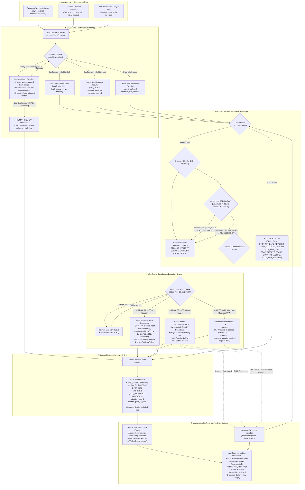

# Razorpay AI Challenge: Track 03 — AI Revenue Recovery
> **"Find revenue that’s slipping away and win it back"**

An autonomous, audit-grade AI Revenue Recovery Agent that detects revenue at risk across recurring payment failures, diagnoses root causes using Razorpay's 3-tier error model and LLM-assisted ambiguity parsing, routes actions through statutory RBI/TRAI compliance policies, executes bounded interventions, and proves measured money recovered compared against a naive baseline with an immutable audit trail.

---

## 🎯 Implementation Scope & Core Focus

* **Primary End-to-End Core:** **Razorpay-Native Payment & Mandate Recovery (Soft & Hard Failures)** — fully implemented end-to-end with the 12-bucket classifier, LLM intent parsing, RBI 2026 E-Mandate compliance checks, smart salary-cycle retry sequencer, dynamic instrument/AFA links, 7 deterministic stopping rules, and measured recovery analytics against a naive baseline.
* **Secondary Modular Extensions:** Checkout Drop-Off recovery and B2B Receivables dunning with PTP tracking are fully designed, architected, and surfaced in the decision router.

---

## 🏛️ End-to-End System Architecture

---

## 🔄 Architectural Stage Breakdown

### 1. Ingestion Layer (`Revenue at Risk`)
* Ingests payment failure and revenue degradation events across core streams:
  * **Failed Subscriptions & Mandates:** `payment.failed`, `subscription.halted` on cards and UPI AutoPay.
  * **Gateway & Network Degrades:** Timeout webhooks, CBS banking 503 outages.
  * **Checkout Abandonments & Drop-offs:** Cart drop-off telemetry and UPI intent session expirations.
  * **B2B Receivables Ledger:** Overdue commercial tax invoices.

### 2. Diagnosis & Classifier (with LLM Diagnostic Engine)
* **Deterministic Classifier:** Fast regex and error-code triage mapping Razorpay's `source` / `step` / `reason` errors into **12 concrete buckets** documented in [root-cause-taxonomy.md](file:///Users/harmitjetani/Documents/GitHub/razorpay-ai-challenge/root-cause-taxonomy.md).
* **LLM Diagnostic & Intent Engine:**
  * **Unstructured Error Resolution:** Disambiguates free-form bank decline text and unknown error payloads.
  * **PTP (Promise-to-Pay) Extraction:** Parses unstructured chat/voice transcripts into structured `{ptp_date, ptp_amount, condition}` entities.
* **Human-in-the-Loop Escalation (`HUMAN_REVIEW`):**
  * If classification confidence is $< 0.70$, or if fraud/chargeback risk flags are detected, the system routes the event to manual operations instead of taking automated action.

### 3. Compliance & Policy Router (Dual-Layer Governance)
* Separates statutory law from internal engineering policies, as codified in [compliance-rules.md](file:///Users/harmitjetani/Documents/GitHub/razorpay-ai-challenge/compliance-rules.md):
  * **Deterministic Stopping Rules:** Instantly halts workflows on `STOP_PAID`, `STOP_MANDATE_REVOKED`, `STOP_MANDATE_EXPIRED`, `STOP_OPT_OUT`, `STOP_DISPUTE_FRAUD`, `STOP_PTP_ACTIVE`, and `STOP_MAX_RETRIES`.
  * **RBI 2026 E-Mandate AFA Verification (Statutory):** Checks if amount $\le ₹15,000$ (Standard) or $\le ₹1,00,000$ (Exempt categories: Mutual Funds, Insurance, Credit Card bills). Prohibits direct auto-debit if cap is exceeded.
  * **TRAI DLT Communication Router (Statutory):** Categorizes outbound messages into official DLT streams: `TRANSACTIONAL`, `SERVICE_IMPLICIT`, `SERVICE_EXPLICIT`, and `PROMOTIONAL`.
  * **MSMED Act 2006 (Statutory Boundary):** Scopes commercial invoices from registered Micro & Small Enterprise (MSE) suppliers to the 45-day statutory ceiling.

### 4. Intelligent Scheduler & Execution Engine
* **TRAI Quiet Hours Filter (Internal Policy):** All outbound proactive communications (SMS, WhatsApp, Voice, and dynamic payment links) pass through the 08:00 AM – 08:00 PM IST filter. Late-night failures are safely held in the **Delayed Dispatch Queue** for 08:05 AM release.
* **Smart Mandate Retry Sequencer:**
  * Dispatches statutory **$\ge 24$-hour Pre-Debit Notifications** with opt-out mechanisms.
  * Applies **Salary-Cycle Snapping Heuristic** (1st–5th / 25th–30th) to prevent premature retry exhaustion.
  * Enforces **$\ge 48$-hour cooling intervals** and a **hard cap of 3 retries** (Internal Safety Policy).
* **Dynamic Instrument / AFA Link (`EXEC_INSTRUMENT_LINK`):**
  * Dispatches 1-click AFA OTP checkout links when `reason: "afa_threshold_exceeded"`.
  * Dispatches secure mandate update links when `reason: "instrument_update_required"`.
* **Multi-Channel Conversational Engine:**
  * **WhatsApp 1-Click UPI Deep-Links:** Instant app-switch payment links for expired UPI collect requests.
  * **Hinglish AI Voice Recovery Agent:** Empathetic voice recovery with PTP negotiation.
  * **Promise-to-Pay (PTP) Tracker:** Automatically freezes retries until `PTP_PROMISE_DATE + 24 hours`.

### 5. Immutable Compliance Audit Trail
* Generates structured, tamper-evident audit records adhering to the compliance schema:
  * End-to-end PII masking (PCI-DSS tokenization & DPDP 2023 compliance across prompts, context, logs, and exports).
  * Auditable `afa_status` (`NOT_REQUIRED`, `EXEMPT_CATEGORY_SIP_INS_CC`, `AFA_REQUIRED_LINK_SENT`, `VALIDATED`).
  * Explicit separation of `statutory_rule_applied` vs `internal_policy_applied`.
  * Verification that post-debit receipts include statutory grievance redressal details (`grievance_details_included: true`).

### 6. Measurement & Comparative Benchmark Engine
* **Comparative Benchmark (`BASELINE_COMPARE`):**
  * Compares the **Agentic Recovery Engine** against a **Naive Retry Baseline** (standard dumb 24-hour fixed retry without liquidity heuristics, AFA threshold checks, cooling windows, or stopping rules).
* **Metrics Dashboard:**
  * **Total Revenue at Risk ($\Sigma \text{Risk}$):** Ingested volume of payment failures.
  * **Measured Money Recovered ($\Sigma \text{Recovered}$):** Confirmed rupee value recovered.
  * **Net Recovery Lift (%):** Incremental revenue recovered over naive baseline.
  * **Bank Penalty Reduction (%):** Reduction in customer bank bounce charges achieved through cooling intervals and salary-cycle snapping.
  * **Compliance Integrity:** **0 Compliance-Guard Bypasses** (enforced by design & architecture, not just observed).

---

## 📂 Project Structure & Reference Documentation

| File | Purpose & Contents |
| :--- | :--- |
| **[compliance-rules.md](file:///Users/harmitjetani/Documents/GitHub/razorpay-ai-challenge/compliance-rules.md)** | Comprehensive dual-layer regulatory specification (RBI 2026 E-Mandate Framework, ₹15k/₹1L AFA caps, 24h pre-debit alerts, TRAI DLT communication taxonomy, MSMED Act 45-day rule, DPDP Act 2023, 7 stopping rules, and audit schema). |
| **[root-cause-taxonomy.md](file:///Users/harmitjetani/Documents/GitHub/razorpay-ai-challenge/root-cause-taxonomy.md)** | Razorpay 3-tier error model taxonomy (`source` / `step` / `reason`), 12 concrete error buckets, retryability rules, 10 critical production edge cases (Zombie payments, salary cycle traps, race conditions, partial payments), and Python classifier code. |
| **[README.md](file:///Users/harmitjetani/Documents/GitHub/razorpay-ai-challenge/README.md)** | System architecture diagram (Mermaid.js), pipeline walkthrough, stage breakdown, and verification metrics. |

---

## 🎯 The Bar
> **Don’t just identify the problem. Show measured money recovered across a batch, with compliant escalation, stopping rules, and an audit trail.**