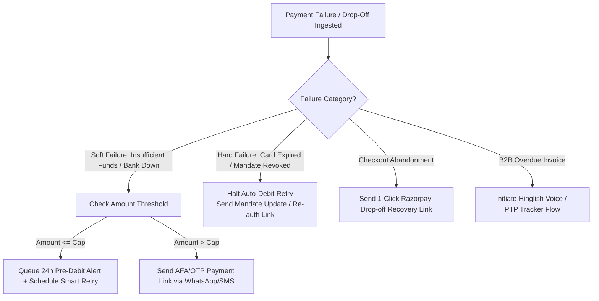

# Compliance Rules & Regulatory Guardrails
## Track 03: AI Revenue Recovery System

---

## 1. Executive Summary & Regulatory Scope

The AI Revenue Recovery agent operates under the strict regulatory oversight of the **Reserve Bank of India (RBI)**, the **National Payments Corporation of India (NPCI)**, the **Telecom Regulatory Authority of India (TRAI)**, and the **Digital Personal Data Protection (DPDP) Act, 2023**.

Any automated intervention—ranging from recurring subscription retries and checkout dunning to Hinglish voice reminders and overdue B2B receivables tracking—must operate within deterministic, provably compliant boundaries.

---

## 2. RBI 2026 E-Mandate Framework & Recurring Payment Regulations

### Statutory References:
1. **Consolidated Framework:** *RBI Digital Payments – E-mandate Framework, 2026* (Circular No. `RBI/DPSS/2026-27/396`)
2. **Foundational e-Mandate Circular:** RBI Circular `DPSS.CO.PD No.447/02.14.003/2019-20` (*Processing of e-mandate on cards for recurring transactions*)
3. **Threshold Increase to ₹15,000:** RBI Circular `CO.DPSS.POLC.No.S-518/02-14-003/2022-23`
4. **Enhanced ₹1,00,000 Exemption:** RBI Circular `RBI/2023-24/90` (`CO.DPSS.POLC.No.S890/02-14-003/2023-24`) for Mutual Funds, Insurance Premiums, and Credit Card Bill Payments.
5. **UPI AutoPay Expansion:** RBI Circular `DPSS.CO.PD No.1324/02.14.003/2019-20` & NPCI UPI AutoPay Operating Guidelines.

---

### Core Statutory Mandates

| Regulation | Compliance Requirement | System Enforcement Rule |
| :--- | :--- | :--- |
| **Mandate Registration AFA** | Initial registration of any recurring e-mandate (Cards, UPI AutoPay, NetBanking, e-NACH) requires mandatory Additional Factor of Authentication (AFA). | `ENFORCE_MANDATE_REGISTRATION_AFA = True`. Reject any recurring auto-debit if valid mandate registration token is absent. |
| **General No-AFA Ceiling (₹15,000)** | Subsequent recurring auto-debits $\le ₹15,000$ per transaction can be charged seamlessly without OTP/AFA. | If `transaction_amount <= 15000` AND `category == "STANDARD"`, proceed to compliant auto-retry sequencing. |
| **Enhanced No-AFA Ceiling (₹1,00,000)** | Recurring payments up to **₹1,00,000** without OTP/AFA are permitted **exclusively** for:<br>• **Mutual Fund Subscriptions (SIPs)**<br>• **Insurance Premium Payments**<br>• **Credit Card Bill Payments** | If `transaction_amount <= 100000` AND `category IN ["MUTUAL_FUND", "INSURANCE", "CREDIT_CARD_BILL"]`, allow direct auto-debit retry. |
| **Transactions Exceeding Thresholds** | Any recurring transaction exceeding ₹15,000 (or ₹1,00,000 for exempt categories) **must not be auto-debited**. | **Hard Stop on Direct Debit**: Agent must generate an **AFA-compliant one-time dynamic payment link** and deliver it via WhatsApp/SMS/Email for customer OTP validation. |
| **Mandatory 24-Hour Pre-Debit Notification** | Issuer / Payment Gateway must deliver a pre-debit alert to the cardholder/account holder at least **24 hours prior** to the scheduled debit timestamp. | Scheduled retry debits must queue a Pre-Debit notification $\ge 24\text{ hours}$ before firing the payment debit API. Alert must state: Merchant Name, Amount, Debit Date, Mandate ID, and Opt-out Link. *(Exemptions: FASTag / NCMC auto-replenishment).* |
| **Post-Debit Confirmation** | Immediate notification confirming debit success or failure reason must be sent to the customer. | Agent triggers webhook-backed post-debit event notification upon receiving gateway response. |
| **Customer Right to Pause / Revoke** | The customer has the absolute legal right to pause, modify, or revoke an active e-mandate at any point. | If customer revokes or pauses mandate (`subscription.halted` / `mandate.revoked`), immediately purge pending retry queues for that mandate. |
| **Prohibition of Customer Surcharges** | Banks/merchants cannot levy penalty charges on customers for utilizing e-mandate facilities. | Auto-retry schedules must not add punitive dunning surcharges to recurring mandate amounts. |

---

## 3. Outreach & Communications Compliance (TRAI TCCCPR & Fair Practices)

### Permissible Contact Windows
- **TRAI Regulatory Calling Hours:** All automated outreach (Interactive Voice Recovery, Hinglish voice bot, WhatsApp reminders, and SMS dunning) is strictly restricted to **08:00 AM to 08:00 PM IST**.
- **Quiet Hours Enforcement:** Any recovery action triggered outside the 08:00 AM – 08:00 PM window must be queued into a delayed scheduler for execution at 08:05 AM the following business morning.

### Frequency Capping & Anti-Harassment Guardrails
- **Max Outreach Per Day:** Maximum of **2 touchpoints per customer per 24-hour cycle** across all non-intrusive channels (SMS, WhatsApp, Email).
- **Voice Call Cap:** Maximum of **1 AI Voice Call per 48-hour cycle**. Never call twice on the same calendar day.
- **Cooling-Off Period:** After 3 consecutive unacknowledged outreaches, enter a **72-hour cooling-off window** before any subsequent reminder.
- **DND Registry Adherence:** Respect user preference flags. If `DND == True`, suppress voice calls and fallback strictly to transactional email / WhatsApp service updates.

---

## 4. Failure Classification & Bounded Intervention Decision Matrix



### Failure Code Action Matrix

| Failure Code / Scenario | Type | Permitted Intervention | Prohibited Action |
| :--- | :--- | :--- | :--- |
| `INSUFFICIENT_FUNDS` | Soft | 24h Pre-Debit Notification $\rightarrow$ Smart retry on predicted salary/liquidity window (1st–5th or 25th–30th). | Immediate back-to-back retries without cooling interval. |
| `GATEWAY_ERROR` / `BANK_DOWNTIME` | Soft | Exponential backoff retry (Wait 2h $\rightarrow$ 6h $\rightarrow$ 24h) with route fallback. | Repeated polling against degraded bank route. |
| `EXPIRED_CARD` / `ACCOUNT_CLOSED` | Hard | Immediate notification with 1-click mandate update link. | Any automated debit retry against expired instrument. |
| `MANDATE_REVOKED_BY_USER` | Hard | Cease auto-debit; send optional subscription cancellation / reactivate email. | Repeated dunning or auto-retrying cancelled mandate. |
| `ABANDONED_CHECKOUT` | Drop-off | WhatsApp cart recovery nudge with personalized incentive / alternate payment rail (UPI). | High-pressure urgency tactics or deceptive pricing. |
| `OVERDUE_B2B_INVOICE` | Receivables | Interactive conversational reminder $\rightarrow$ Promise-to-Pay (PTP) negotiation. | Defamatory or threatening communication. |

---

## 5. Deterministic Stopping Rules & Boundary Conditions

The AI Revenue Recovery Agent must **immediately terminate** all automated dunning, retries, and communications when any of the following boundary conditions are met:

1. **`STOP_PAID` (Successful Recovery):**
   * *Condition:* Webhook event `payment.captured`, `subscription.charged`, or `invoice.paid` received.
   * *Action:* Instantly cancel all pending retry jobs, unschedule outbound calls, and dispatch a post-debit confirmation receipt.
2. **`STOP_PTP_ACTIVE` (Promise-to-Pay Grace Period):**
   * *Condition:* Customer explicitly commits: *"I will pay by Friday 5 PM"*.
   * *Action:* Record timestamped `PTP_PROMISE_DATE`. **Freeze all dunning/retries** until `PTP_PROMISE_DATE + 24 hours`.
3. **`STOP_OPT_OUT` (Explicit Customer Request):**
   * *Condition:* Customer replies *"STOP"*, clicks *"Cancel Mandate"*, or clicks unsubscribe.
   * *Action:* Instantly halt all recovery workflows. Mark status as `OPTED_OUT_BY_CUSTOMER`.
4. **`STOP_MAX_RETRIES` (Exhaustion Limit):**
   * *Condition:* Mandate retry count reaches **3 attempts** or dunning cycle exceeds **14 days**.
   * *Action:* Mark as `UNRECOVERABLE_EXHAUSTED`. Pause subscription gracefully and route to human ops.
5. **`STOP_DISPUTE_FRAUD` (Risk & Compliance Flag):**
   * *Condition:* Customer flags unauthorized debit or files a chargeback dispute (`payment.disputed`).
   * *Action:* Immediate lockdown of recovery agent. Escalate case to Razorpay Risk & Fraud team.

---

## 6. Data Privacy, DPDP 2023 & Fair Recovery Standards

- **PII & Card Data Redaction:**
  * Raw 16-digit Primary Account Numbers (PAN) and CVVs must **never** be logged in transcripts, agent context, or audit databases (PCI-DSS compliance).
  * Customer identifiers must be masked in audit outputs (e.g., `+91-98****1234`, `****-****-****-4012`, `rahul****@gmail.com`).
- **Ethical & Respectful Hinglish Tone:**
  * Voice recovery agent must introduce itself as an authorized Razorpay AI Assistant.
  * Tone must remain polite, empathetic, and constructive (e.g., *"Namaste Rahul ji, hum Razorpay se call kar rahe hain regarding your pending invoice..."*).
  * Zero tolerance for intimidation, unverified claims, or calling relatives/third parties.

---

## 7. Compliance Audit Trail Schema

Every recovery decision, evaluation, and action must be recorded into an immutable audit trail adhering to this exact schema:

```json
{
  "audit_id": "aud_rec_9823471029",
  "timestamp": "2026-08-27T10:15:30.000Z",
  "entity_id": "sub_Nx871239Ka",
  "customer_masked": "+91-98****9012",
  "amount_inr": 4999.00,
  "category": "STANDARD",
  "afa_required": false,
  "event_type": "PRE_DEBIT_NOTIFICATION_DISPATCHED",
  "channel": "WHATSAPP_SMS",
  "rule_applied": "RBI_2026_MANDATORY_24H_PRE_DEBIT",
  "trai_window_check": "PASS_08_TO_20_IST",
  "decision_rationale": "Soft failure INSUFFICIENT_FUNDS. Amount <= 15000 INR. Queued pre-debit alert 24h prior to retry attempt #1 on estimated salary credit date.",
  "outcome_status": "QUEUED_FOR_RETRY",
  "active_ptp_date": null,
  "stop_rule_triggered": null
}
```

---

## 8. Summary Checklist for Agent Verification

- [x] RBI 2026 e-Mandate Framework cited with ₹15,000 / ₹1,00,000 AFA thresholds.
- [x] Mandatory 24-hour pre-debit alert and post-debit confirmation rules codified.
- [x] Soft failure vs. hard failure deterministic routing matrix defined.
- [x] TRAI 08:00 AM – 08:00 PM contact window and frequency caps implemented.
- [x] 5 Deterministic Stopping Rules (`STOP_PAID`, `STOP_PTP_ACTIVE`, `STOP_OPT_OUT`, `STOP_MAX_RETRIES`, `STOP_DISPUTE`).
- [x] DPDP 2023 / PCI-DSS PII masking standards established.
- [x] Immutable compliance audit trail schema specified.
