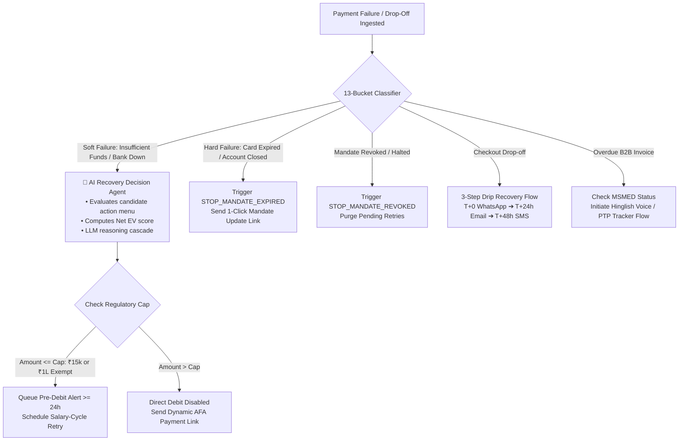

# Compliance Rules & Regulatory Guardrails
## Track 03: AI Revenue Recovery System

---

## 1. Executive Summary & Dual-Layer Governance Architecture

The AI Revenue Recovery Agent operates on a **dual-layer compliance architecture**:
1. **Layer 1: Statutory & Regulatory Framework (The Law)** — Mandatory rules codified by the **Reserve Bank of India (RBI)**, **National Payments Corporation of India (NPCI)**, **Telecom Regulatory Authority of India (TRAI)**, **Micro, Small and Medium Enterprises Development (MSMED) Act, 2006**, **Consumer Protection Act, 2019 (CPA 2019 / Central Consumer Protection Authority Guidelines, 2023)**, and the **DPDP Act, 2023 (with DPDP Rules, 2025)**.
2. **Layer 2: Internal System Policies & Architectural Guardrails (Engineering Controls)** — Operational rate-limiters, safety stopping rules, anti-harassment heuristics, and retry sequencing bounds implemented in the recovery state machine.

```
┌──────────────────────────────────────────────────────────────────────────────────┐
│                   LAYER 1: STATUTORY & REGULATORY MANDATES                       │
│  • RBI E-Mandate Framework (₹15k / ₹1L AFA Caps, ≥24h Pre-Debit Alerts, Expiry)  │
│  • NPCI UPI AutoPay Rails & Validation Standards                                │
│  • MSMED Act Section 15/16 (MSE Supplier 45-Day Terms & Statutory Interest)      │
│  • Consumer Protection / CCPA Anti-Dark-Patterns (No Subscription Traps)        │
│  • DPDP Act 2023 & Rules 2025 (End-to-End PII Redaction across LLM & Logs)      │
│  • TRAI TCCCPR Communication Taxonomy (Transactional, Service, Promotional)     │
└────────────────────────────────────────┬─────────────────────────────────────────┘
                                         │ Governs & Constrains
┌────────────────────────────────────────▼─────────────────────────────────────────┐
│              LAYER 2: INTERNAL SYSTEM POLICIES & RECOVERY ENGINE                 │
│  • Internal Contact Window: 08:00 AM – 08:00 PM IST (Quiet Hours Queue)          │
│  • Anti-Harassment Caps: Max 2 touches/24h, Max 1 Voice Call/48h                 │
│  • Smart Retry Sequencer: Max 3 Retries, Min 48h Cooling-off, Salary Heuristics │
│  • Deterministic Stopping Rules (STOP_PAID, STOP_EXPIRED, STOP_PTP, etc.)        │
│  • AFA Dynamic Payment Link & 1-Click Drop-off Recovery Fallbacks                │
│  • Immutable Multi-Field Compliance Audit Trail with `afa_status` Logging        │
└──────────────────────────────────────────────────────────────────────────────────┘
```

---

# PART I: STATUTORY & REGULATORY MANDATES (THE LAW)

## 2. RBI E-Mandate Framework & Recurring Payment Regulations

### Statutory References:
* **Consolidated Framework:** *RBI Digital Payments – E-mandate Framework, 2026* (Circular No. `RBI/DPSS/2026-27/396`)
* **Foundational e-Mandate Circulars:** `DPSS.CO.PD No.447/02.14.003/2019-20` (Cards) & `DPSS.CO.PD No.1324/02.14.003/2019-20` (UPI/PPIs)
* **General Limit Modification (₹15,000):** RBI Circular `CO.DPSS.POLC.No.S-518/02-14-003/2022-23`
* **Exempt Category Relaxation (₹1,00,000):** RBI Circular `RBI/2023-24/90` (`CO.DPSS.POLC.No.S890/02-14-003/2023-24`)
* **Transit / FASTag Exemption:** RBI Circular `CO.DPSS.POLC.No.S-545/02-14-003/2024-25`

---

### Core Statutory Mandates & Regulatory Standards

| Regulatory Requirement | Statutory Rule | System Compliance Action |
| :--- | :--- | :--- |
| **Mandate Registration AFA** | Initial registration of any recurring e-mandate (Cards, UPI AutoPay, NetBanking, e-NACH) requires mandatory Additional Factor of Authentication (AFA). | `ENFORCE_MANDATE_REGISTRATION_AFA = True`. Verify successful registration authentication before enabling automated recurring debits. |
| **General No-AFA Ceiling (₹15,000)** | Subsequent recurring transactions up to **₹15,000 per transaction** can be processed without requiring AFA/OTP for each debit cycle across recurring payments. | Transactions $\le ₹15,000$ are routed to automated debit retry workflows. Set `afa_status = "NOT_REQUIRED"`. |
| **Enhanced No-AFA Ceiling (₹1,00,000)** | Recurring transactions up to **₹1,00,000 per transaction** without per-cycle AFA are permitted **strictly and exclusively** for:<br>1. **Mutual Fund Subscriptions (SIPs)**<br>2. **Payment of Insurance Premiums**<br>3. **Credit Card Bill Payments** | If `category IN ["MUTUAL_FUND", "INSURANCE_PREMIUM", "CREDIT_CARD_BILL"]` and `amount <= 100000`, allow automated recurring debit. Set `afa_status = "EXEMPT_CATEGORY_SIP_INS_CC"`. |
| **Transactions Exceeding Statutory Caps** | Any recurring transaction exceeding ₹15,000 (or ₹1,00,000 for exempt categories) **requires per-cycle AFA/OTP validation**. | **Direct Auto-Debit Disabled**: The agent triggers an AFA checkout intervention (e.g. generating an AFA-compliant one-time payment link sent via WhatsApp/SMS/Email). Set `afa_status = "AFA_REQUIRED_LINK_SENT"`. |
| **Mandatory Pre-Debit Notification** | Issuers/payment systems must dispatch a pre-debit alert to the customer **at least 24 hours prior** to the actual debit timestamp. *(Exemption: Auto-replenishment for FASTag/NCMC transit balances).* | Mandatory check: Ensure `scheduled_debit_time - pre_debit_alert_time >= 24 hours`. The alert must contain: Merchant Name, Amount, Date of Debit, Mandate ID, and a facility/link to opt-out. |
| **Post-Debit Confirmation & Grievance Details** | Issuers/systems must send immediate post-debit notification confirming payment success or failure reason, and must include **grievance redressal information**. | `POST_DEBIT_NOTIFICATION_MUST_INCLUDE_GRIEVANCE_DETAILS = True`. Every confirmation receipt must include transaction reference, amount, timestamp, and a link/contact for customer support/dispute redressal. |
| **Mandate Modification & Withdrawal Facility** | Banks/issuers must provide customers with accessible facilities to modify validity, amount limits, or withdraw/cancel active e-mandates subject to appropriate authentication. | If customer revokes mandate (`mandate.revoked` or `subscription.halted`), immediately execute `STOP_MANDATE_REVOKED` and purge pending retries. |
| **Mandate Validity Period & Expiry** | E-mandates are valid only within their defined validity timeline. | Check mandate `valid_until` timestamp. If expired, trigger `STOP_MANDATE_EXPIRED` and disable automated debits. |
| **Prohibition of Customer Surcharges** | Banks and merchants are prohibited from levying charges on customers for availing e-mandate facilities. | Auto-retry schedules must not add punitive dunning surcharges to recurring mandate amounts. |

---

## 3. MSMED Act, 2006 (B2B Commercial Receivables)

For B2B Overdue Receivables Chaser and Commercial Invoice workflows:

### Statutory Provisions:
1. **Section 15 (Liability of Buyer to Make Payment):**
   * Where a business purchases goods or services from a registered **Micro or Small Enterprise (MSE) supplier**, the buyer must make payment on or before the agreed date.
   * If no agreement exists, payment is due within **15 days**.
   * In no case shall the agreed credit period exceed **45 days** from the day of acceptance or deemed acceptance.
2. **Section 16 (Compound Interest on Delayed Payment):**
   * Delayed payments to registered MSE suppliers attract mandatory compound interest with monthly rests at **3x the Bank Rate** notified by the Reserve Bank of India.

### System Compliance Boundary:
* **Identification:** Differentiate between registered MSE suppliers (governed by the statutory 45-day rule) and general enterprise receivables.
* **Transparent Referencing:** All B2B communications must accurately cite the original Tax Invoice Number, Purchase Order (PO), GSTIN, Acceptance Date, and Due Date.
* **Legal Status of Promise-to-Pay (PTP):** Recording a PTP pauses automated AI dunning as an internal workflow control, but does not legally extinguish statutory interest accrual under Section 16 unless formal settlement is executed.

---

## 4. Consumer Protection (E-Commerce) Rules & Anti-Dark-Patterns (CCPA 2023)

For Checkout Drop-off Recovery & Cart Abandonment workflows:

1. **Prohibition of "Subscription Traps" & "Forced Continuity":** Recovery nudges must never deceptively enroll a user into recurring billing without explicit, affirmative consent.
2. **Prohibition of "Basket Sneaking" & Deceptive Pricing:** Checkout links must transparently disclose the itemized subtotal, applicable taxes/GST, and recurring billing frequency (if any).
3. **Opt-Out Mechanism:** Every promotional or cart recovery communication must provide a straightforward opt-out mechanism (e.g. reply `STOP` or 1-click unsubscribe).

---

## 5. DPDP Act, 2023 & DPDP Rules, 2025 (Data Privacy & Redaction)

* **End-to-End PII Redaction Scope:** Masking of Personally Identifiable Information (PII) and card data is **not restricted to final audit logs**. It must be enforced across:
  * **LLM Prompts & Agent Context** (Raw PAN/CVV must never enter LLM context).
  * **Application Debug Logs & Transcripts**.
  * **Audit Records, Analytics Datasets, and Export Files**.
* **PCI-DSS Tokenization & Masking Standards:**
  * Primary Account Numbers (PAN): Display only last 4 digits (e.g. `****-****-****-4012`).
  * Customer Phone: Mask central digits (e.g. `+91-98****9012`).
  * Customer Email: Mask mailbox name (e.g. `r*****l@domain.com`).

---

## 6. Telecom & Communication Classification (TRAI TCCCPR)

Communications must be classified into proper regulatory streams rather than using a single binary DND switch:

| Communication Type | Description & Purpose | Consent & Preference Rules | Permitted Channels |
| :--- | :--- | :--- | :--- |
| **`TRANSACTIONAL`** | OTPs, debit confirmations, critical security alerts. | Sent to all customers; exempt from DND registration. | SMS, Email, In-App Push. |
| **`SERVICE`** | Mandatory 24h pre-debit notifications, mandate status changes, payment failure alerts (inferred/explicit service relationship). | Sent to active subscribers/account holders; service updates permitted. | SMS, Email, WhatsApp Service Messages. |
| **`RECOVERY`** | Overdue invoice reminders, payment retry alerts, B2B receivable follow-ups. | Permitted under commercial contract; subject to internal fair-practice frequency caps. | WhatsApp, Email, Voice Recovery Agent. |
| **`PROMOTIONAL`** | Abandoned checkout nudges, discount recovery offers, re-engagement campaigns. | Strictly subject to TRAI commercial communication rules, UCC preference registry (DND), and explicit opt-in. | WhatsApp Promotional, SMS Promotional (09:00 AM – 08:00 PM window). |

---

# PART II: INTERNAL SYSTEM POLICIES & RECOVERY ENGINE (ENGINEERING CONTROLS)

## 7. Internal Operational Hours & Anti-Harassment Policies

These rules represent our **internal safety and fair-practice guardrails** (distinct from statutory law):

* **Internal Safe Outreach Window (08:00 AM – 08:00 PM IST):**
  * All automated recovery interactions (AI Voice recovery calls, WhatsApp nudges, and dunning messages) are restricted to **08:00 AM to 08:00 PM IST**.
  * **Quiet Hours Queue:** Any event triggered outside this window is queued in a delayed scheduler and dispatched at 08:05 AM the next morning.
* **Internal Frequency Caps:**
  * **Max 2 touches per customer per 24 hours** across non-intrusive channels (SMS, WhatsApp, Email).
  * **Max 1 AI Voice Call per 48 hours** per customer. Never place consecutive calls on the same day.
  * **72-Hour Cooling-Off Window:** After 3 consecutive unacknowledged outreaches, pause automated contact for 72 hours before subsequent dunning.
* **Respectful & Empathetic Hinglish Voice Tone:**
  * The voice bot must introduce itself clearly as an authorized AI recovery assistant.
  * Zero tolerance for aggressive, threatening, or high-pressure dunning language.

---

## 8. Failure Classification & Decision Routing Engine



### Failure Code Action Matrix

| Failure Code / Scenario | Classification | Internal System Intervention | Strict Boundary Condition |
| :--- | :--- | :--- | :--- |
| `INSUFFICIENT_FUNDS` | Soft Failure | AI Agent EV scoring $\rightarrow$ Dispatch 24h pre-debit alert $\rightarrow$ Schedule retry aligned with salary heuristics (1st–5th or 25th–30th). | Must strictly uphold the statutory $\ge 24\text{h}$ pre-debit notice before firing retry. |
| `GATEWAY_ERROR` / `BANK_DOWNTIME` | Soft Failure | Exponential backoff with route fallback $\rightarrow$ WhatsApp UPI intent deep-link. | Stop hammering degraded bank routes. |
| `EXPIRED_CARD` / `ACCOUNT_CLOSED` | Hard Failure | Immediate status update; deliver 1-click mandate instrument update link. | Zero automated retry against expired instrument. |
| `MANDATE_REVOKED` / `CANCELLED` | Hard Failure | Execute `STOP_MANDATE_REVOKED`; cancel all queued dunning tasks. | Never attempt debits on cancelled mandates. |
| `MANDATE_EXPIRED` | Hard Failure | Execute `STOP_MANDATE_EXPIRED`; send re-registration invite. | Never attempt debits past mandate validity date. |
| `ABANDONED_CHECKOUT` | Drop-off | 3-step drip recovery (T+0 WhatsApp $\rightarrow$ T+24h Email $\rightarrow$ T+48h expiring discount SMS). | No hidden charges, consent required, max 3 touches. |
| `OVERDUE_B2B_INVOICE` | Receivables | Conversational Hinglish reminder $\rightarrow$ Promise-to-Pay (PTP) scheduling under MSMED terms. | Professional conduct; no defamatory outreach. |

---

## 9. Deterministic Stopping Rules & State Machine Guardrails

The recovery engine enforces **7 deterministic stopping rules** that immediately halt automated dunning and retries:

| Stopping Rule | Trigger Condition | System Action & State Transition | Category |
| :--- | :--- | :--- | :--- |
| **`STOP_PAID`** | Webhook received: `payment.captured`, `subscription.charged`, or `invoice.paid`. | Instantly cancel all pending retries/calls; dispatch post-debit confirmation with grievance details. | **Statutory / Resolution** |
| **`STOP_MANDATE_REVOKED`** | Webhook received: `mandate.revoked` or `subscription.halted`. | Purge all pending retries; mark mandate as inactive. | **Statutory / Compliance** |
| **`STOP_MANDATE_EXPIRED`** | Current timestamp exceeds mandate `valid_until` date. | Cease all auto-debit retries; send mandate re-registration invitation. | **Statutory / Compliance** |
| **`STOP_OPT_OUT`** | Customer sends `"STOP"`, clicks unsubscribe, or requests communication halt. | Immediately cease all outbound recovery communications on that channel. | **Regulatory / Consent** |
| **`STOP_DISPUTE_FRAUD`** | Chargeback filed (`payment.disputed`) or unauthorized transaction flag raised. | Immediate lockdown of recovery workflow; escalate case to authorized risk and fraud operations. | **Regulatory / Risk** |
| **`STOP_PTP_ACTIVE`** | Customer commits to pay by a specific date (e.g. *"Will pay by Friday 5 PM"*). | Record `PTP_PROMISE_DATE`. **Freeze all dunning and retries** until `PTP_PROMISE_DATE + 24 hours`. | **Internal System Policy** |
| **`STOP_MAX_RETRIES`** | System reaches cap of **3 retry debit attempts** or **14 days in dunning**. | Mark status as `UNRECOVERABLE_EXHAUSTED`; gracefully pause subscription and route to human ops. | **Internal System Policy** |

---

## 10. Compliance Audit Trail Specification

Every evaluation, decision, and action taken by the AI Revenue Recovery Agent must be recorded into an immutable audit trail adhering to this exact schema:

```json
{
  "audit_id": "aud_rec_9823471029",
  "timestamp": "2026-08-27T10:15:30.000Z",
  "entity_id": "sub_Nx871239Ka",
  "customer_masked": "+91-98****9012",
  "amount_inr": 4999.00,
  "category": "STANDARD",
  "communication_type": "SERVICE",
  "afa_required": false,
  "afa_status": "NOT_REQUIRED",
  "event_type": "PRE_DEBIT_NOTIFICATION_DISPATCHED",
  "channel": "WHATSAPP_SMS",
  "statutory_rule_applied": "RBI_2026_MANDATORY_24H_PRE_DEBIT",
  "internal_policy_applied": "INTERNAL_SAFE_HOURS_08_TO_20_IST",
  "decision_rationale": "Soft failure INSUFFICIENT_FUNDS. Amount <= 15000 INR (no AFA required). Dispatched mandatory pre-debit alert >= 24h prior to scheduled retry #1.",
  "outcome_status": "PRE_DEBIT_DELIVERED",
  "grievance_details_included": true,
  "active_ptp_date": null,
  "stop_rule_triggered": null
}
```

### Permitted `afa_status` Values:
* `"NOT_REQUIRED"`: Recurring debit $\le ₹15,000$ across standard recurring transactions.
* `"EXEMPT_CATEGORY_SIP_INS_CC"`: Recurring debit $\le ₹1,00,000$ for Mutual Funds, Insurance Premiums, or Credit Card Bills.
* `"AFA_REQUIRED_LINK_SENT"`: Amount exceeds statutory threshold; AFA dynamic payment link dispatched.
* `"VALIDATED"`: OTP/AFA verified during mandate registration or dynamic payment link completion.

---

## 11. Final Compliance Verification Checklist

- [x] **Dual-Layer Architecture:** Clearly distinguishes Statutory Mandates (RBI, NPCI, MSMED, DPDP, TRAI) from Internal System Policies.
- [x] **RBI E-Mandate Framework:** Accurately cites ₹15,000 general cap and ₹1,00,000 exemption for Mutual Funds, Insurance, and Credit Card bills (`RBI/2023-24/90`).
- [x] **Mandatory Pre-Debit Alert:** Enforces statutory $\ge 24$-hour pre-debit alert before any retry debit.
- [x] **Post-Debit Grievance Details:** Mandates inclusion of grievance redressal officer details and dispute links in post-debit receipts.
- [x] **Mandate Expiry Handling:** Codifies `STOP_MANDATE_EXPIRED` alongside `STOP_MANDATE_REVOKED`.
- [x] **MSMED Act Section 15/16:** Accurately scopes 45-day payment ceilings to registered Micro and Small Enterprise suppliers.
- [x] **TRAI Communication Taxonomy:** Implements `TRANSACTIONAL`, `SERVICE`, `RECOVERY`, and `PROMOTIONAL` classification.
- [x] **End-to-End PII Redaction:** Redaction enforced across LLM prompts, context, logs, transcripts, and audit records.
- [x] **Internal Safety Guardrails:** Correctly labels 08:00–20:00 contact window, max 3 retries, 48h cooling interval, and PTP freeze as internal system policies.
- [x] **Auditable `afa_status`:** Implemented in the immutable audit log schema.
